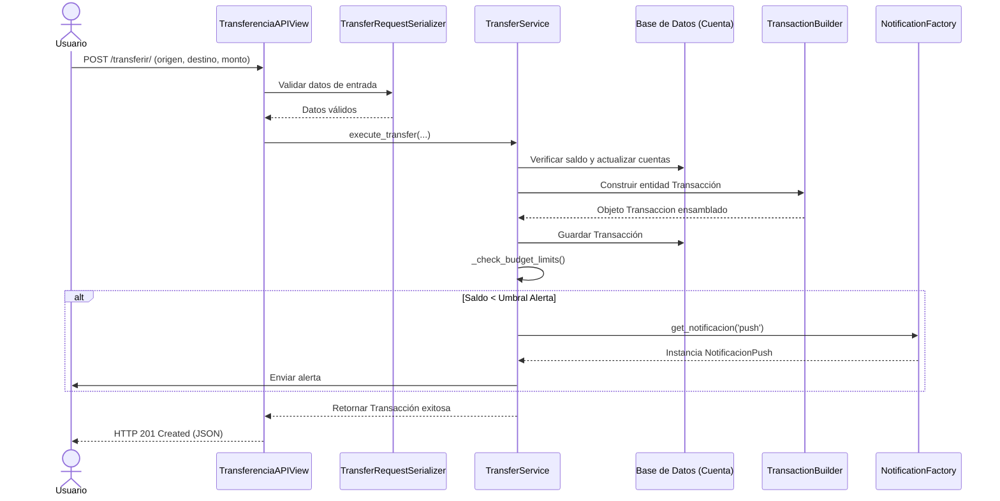

# Guía de Sustentación - Entrega No. 1
## Arquitectura de Software 2026

Repositorio: https://github.com/thomasbedoya0192-droid/Proyecto_Arquitectura

---

## 1. Núcleo de Negocio: Capa de Dominio

### Lo que pide la guía:
"Implementar entre el 50% y el 60% de las clases del modelo de datos propuestas en sus diagramas."

### Lo que hicimos:

En el archivo `finanzas/models.py` implementamos 6 entidades principales que representan el dominio del sistema de gestión financiera:

#### 1.1 Cuenta
Esta es la entidad raíz del sistema. Representa las diferentes carteras o cuentas bancarias que un usuario puede tener.

```python
class Cuenta(models.Model):
    nombre = models.CharField(max_length=100)
    saldo = models.DecimalField(...)
    tipo = models.CharField(...)  # banco, efectivo, tarjeta, digital, ahorros
    moneda = models.CharField(...)  # COP, USD, EUR
```

¿Por qué DecimalField y no FloatField? Porque estamos trabajando con dinero. Los floats tienen errores de redondeo (0.1 + 0.2 ≠ 0.3 en binario). Decimal garantiza precisión.

La validación `clean()` asegura que el saldo nunca sea negativo. Esto se ejecuta automáticamente en `save()`.

#### 1.2 Tope
Controla límites de gasto. Un usuario puede tener un tope semanal y mensual para gastar.

```python
class Tope(models.Model):
    cuenta = models.OneToOneField(Cuenta, ...)
    limite_semanal = models.DecimalField(...)
    limite_mensual = models.DecimalField(...)
    umbral_alerta = models.DecimalField(...)
```

¿Por qué OneToOneField? Porque cada cuenta tiene UN único tope. Si usáramos ForeignKey, una cuenta podría tener múltiples topes, lo cual no tiene sentido.

#### 1.3 Transaccion
El corazón del sistema. Registra todo movimiento de dinero.

```python
class Transaccion(models.Model):
    TIPO_CHOICES = [("ingreso", "Ingreso"), ("gasto", "Gasto"), ("transferencia", "Transferencia")]
    
    cuenta_origen = models.ForeignKey(Cuenta, ...)
    cuenta_destino = models.ForeignKey(Cuenta, ...)
    categoria = models.ForeignKey(Categoria, ...)
    etiquetas = models.ManyToManyField(Etiqueta, ...)
    monto = models.DecimalField(...)
    tipo = models.CharField(...)
```

Aquí usamos ForeignKey para las cuentas porque una transacción necesita referencias a cuentas (origen/destino). ManyToManyField para etiquetas porque una transacción puede tener múltiples etiquetas.

Las validaciones aseguran lógica de negocio:
- El monto siempre es positivo
- Una transferencia requiere OBLIGATORIAMENTE origen y destino
- No se puede transferir a la misma cuenta

#### 1.4 Categoria
Clasifica las transacciones (Alimentación, Transporte, etc.)

```python
class Categoria(models.Model):
    nombre = models.CharField(max_length=100, unique=True)
    descripcion = models.TextField(blank=True)
    color = models.CharField(...)  # Para UI, ej: #FF5733
```

El `unique=True` garantiza que no haya dos categorías con el mismo nombre.

#### 1.5 Etiqueta
Tags adicionales para clasificar transacciones de forma flexible.

```python
class Etiqueta(models.Model):
    nombre = models.CharField(max_length=50, unique=True)
    descripcion = models.TextField(blank=True)
```

Similar a Categoria pero más flexible. Alguien podría etiquetar una transacción como "#urgente" o "#deuda".

#### 1.6 Presupuesto
Control presupuestario por categoría.

```python
class Presupuesto(models.Model):
    cuenta = models.ForeignKey(Cuenta, ...)
    categoria = models.ForeignKey(Categoria, ...)
    monto_limite = models.DecimalField(...)
    monto_gastado = models.DecimalField(...)
    porcentaje_alerta = models.IntegerField(...)  # Ej: 80%
```

Incluimos métodos calculados:
- `porcentaje_utilizado()`: Calcula qué % del presupuesto se ha usado
- `alerta_disparada()`: Retorna True si se alcanzó el umbral de alerta

### ¿Cumplimos con 50-60%?

Con 6 entidades de dominio, sí. El modelo original tenía 3 clases (Cuenta, Tope, Transaccion). Agregamos 3 más (Categoria, Etiqueta, Presupuesto) que completan un modelo más robusto.

Es como construir una casa: los muros básicos (Cuenta, Transaccion) ya estaban. Agregamos los acabados (Categoria, Etiqueta, Presupuesto) que hacen el sistema usable.

---

## 2. Capa de Aplicación: Service Layer (Reglas de Negocio)

### Lo que pide la guía:
"Prohibido: Lógica de negocio en las Views o en los Serializers. Cada flujo de negocio principal debe estar orquestado por una clase en services.py. Se evalúa SOLID, especialmente el Principio de Responsabilidad Única."

### Lo que hicimos:

En `finanzas/services.py` creamos 3 servicios que orquestan la lógica de negocio:

#### 2.1 TransferService
Maneja transferencias entre cuentas.

```python
class TransferService:
    @staticmethod
    def execute_transfer(origen_id, destino_id, monto):
        with transaction.atomic():
            # 1. Bloquear registros para evitar condiciones de carrera
            origen = Cuenta.objects.select_for_update().get(id=origen_id)
            destino = Cuenta.objects.select_for_update().get(id=destino_id)
            
            # 2. Validar lógica de negocio
            if origen.saldo < monto:
                raise ValueError("Fondos insuficientes...")
            
            # 3. Actualizar estado
            origen.saldo -= monto
            destino.saldo += monto
            origen.save()
            destino.save()
            
            # 4. Crear registro (usando Builder)
            builder = TransactionBuilder()
            nueva_transaccion = builder.set_cuentas(origen, destino).build()
            nueva_transaccion.save()
            
            # 5. Verificar topes y notificar
            TransferService._check_budget_limits(origen)
            
            return nueva_transaccion
```

¿Qué es `transaction.atomic()`? Garantiza que TODA la operación es "todo o nada". Si algo falla, todo se revierte. Es crucial en operaciones financieras.

¿Qué es `select_for_update()`? Bloquea el registro en la base de datos mientras lo estamos modificando. Previene condiciones de carrera (race conditions) donde dos transacciones simultáneas podrían causar inconsistencia.

#### 2.2 GastoService
Maneja el registro de gastos con actualización automática de presupuestos.

```python
class GastoService:
    @staticmethod
    def registrar_gasto(cuenta_id, categoria_id, monto, descripcion="", etiquetas_ids=None):
        with transaction.atomic():
            # 1. Validar fondos
            cuenta = Cuenta.objects.select_for_update().get(id=cuenta_id)
            if cuenta.saldo < monto:
                raise ValueError("Fondos insuficientes...")
            
            # 2. Crear transacción
            cuenta.saldo -= monto
            cuenta.save()
            
            builder = TransactionBuilder()
            transaccion = builder.set_cuentas_gasto(cuenta).set_detalles(...).build()
            transaccion.save()
            
            # 3. Actualizar presupuestos
            GastoService._actualizar_presupuestos(cuenta, categoria, monto)
            
            # 4. Verificar alertas
            GastoService._check_budget_alerts(cuenta, categoria)
```

Esto demuestra la orquestación real de un flujo de negocio. No es solo guardar datos; es ejecutar una secuencia de pasos que mantiene la integridad.

#### 2.3 PresupuestoService
Gestiona consultas y análisis de presupuestos.

```python
class PresupuestoService:
    @staticmethod
    def obtener_estado_presupuestos(cuenta_id):
        # Retorna estado consolidado de todos los presupuestos activos
        # Incluye: porcentaje utilizado, alertas disparadas, etc.
```

### ¿Dónde está la lógica de negocio?

Todo en `services.py`. Verifiquemos que Views y Serializers estén limpios:

**views.py**: Solo tiene 3 responsabilidades
```python
class GastoAPIView(APIView):
    def post(self, request):
        # 1. Validar entrada con Serializer
        serializer = GastoRequestSerializer(data=request.data)
        if not serializer.is_valid():
            return Response(serializer.errors, status=400)
        
        # 2. Delegar al Service
        try:
            transaccion = GastoService.registrar_gasto(...)
        except ValueError as e:
            return Response({"error": str(e)}, status=409)
        
        # 3. Serializar salida
        output_serializer = TransaccionSerializer(transaccion)
        return Response(output_serializer.data, status=201)
```

No hay lógica de negocio aquí. Solo HTTP concerns (validación, códigos de estado, serialización).

**Principio de Responsabilidad Única (SRP):**
- TransferService: Responsable solo de transferencias
- GastoService: Responsable solo de gastos
- PresupuestoService: Responsable solo de presupuestos
- APIView: Responsable solo de HTTP
- Serializers: Responsables solo de validación de datos

Si mañana queremos cambiar cómo se calculan alertas, solo tocamos `GastoService`. Si queremos cambiar el formato de respuesta HTTP, solo tocamos `views.py`.

---

## 3. Capa de Presentación: DRF (Django REST Framework)

### Lo que pide la guía:
"Implementación de Serializers para entrada y salida de datos. Uso de APIView para control total. Manejo correcto de códigos de estado HTTP (201, 400, 404, 409)."

### Lo que hicimos:

#### 3.1 Serializers

En `finanzas/serializers.py` creamos serializers especializados:

**Para entrada (DTOs)**:
```python
class TransferRequestSerializer(serializers.Serializer):
    origen_id = serializers.IntegerField()
    destino_id = serializers.IntegerField()
    monto = serializers.DecimalField(max_digits=12, decimal_places=2)
    
    def validate_monto(self, value):
        if value <= 0:
            raise serializers.ValidationError("El monto debe ser mayor a 0.")
        return value
```

¿Por qué no es ModelSerializer? Porque no necesitamos todos los campos del modelo. Solo queremos origen_id, destino_id y monto. Los ModelSerializers exponen TODOS los campos, lo cual es inseguro.

**Para salida (Modelos completos)**:
```python
class TransaccionSerializer(serializers.ModelSerializer):
    categoria_nombre = serializers.CharField(source='categoria.nombre', read_only=True)
    etiquetas_nombres = serializers.SerializerMethodField()
    
    class Meta:
        model = Transaccion
        fields = ['id', 'cuenta_origen', 'cuenta_destino', 'categoria', 
                  'categoria_nombre', 'etiquetas', 'etiquetas_nombres', 'monto', 'tipo', ...]
```

Aquí UsAMOS ModelSerializer porque queremos serializar la entidad completa. Agregamos campos derivados como `categoria_nombre` para hacer más útil la respuesta.

#### 3.2 APIViews

En `finanzas/views.py` usamos APIView en lugar de ViewSets:

```python
class TransferenciaAPIView(APIView):
    def post(self, request):
        serializer = TransferRequestSerializer(data=request.data)
        if not serializer.is_valid():
            return Response(serializer.errors, status=status.HTTP_400_BAD_REQUEST)
        
        try:
            transaccion = TransferService.execute_transfer(...)
            output_serializer = TransaccionSerializer(transaccion)
            return Response(output_serializer.data, status=status.HTTP_201_CREATED)
        
        except ObjectDoesNotExist:
            return Response({"error": "Una o ambas cuentas no existen."}, 
                          status=status.HTTP_404_NOT_FOUND)
        except ValueError as e:
            return Response({"error": str(e)}, status=status.HTTP_409_CONFLICT)
```

¿Por qué APIView y no ViewSets? Porque queremos control total sobre el flujo. Un ViewSet asume mucha convención (list, create, update, delete) que no necesitamos aquí.

#### 3.3 Códigos de Estado HTTP

Implementamos correctamente:

- **201 CREATED**: Cuando se crea un recurso exitosamente (transferencia, gasto)
- **400 BAD REQUEST**: Cuando los datos de entrada son inválidos
- **404 NOT FOUND**: Cuando un recurso no existe (cuenta no encontrada)
- **409 CONFLICT**: Cuando hay un conflicto lógico (fondos insuficientes)

Cada código comunica el tipo de error de forma clara a quien consume la API.

#### 3.4 Endpoints Implementados

```
POST   /api/finanzas/transferir/              → Transferencias
POST   /api/finanzas/gastos/                  → Registrar gastos
GET    /api/finanzas/cuentas/                 → Listar cuentas
POST   /api/finanzas/cuentas/                 → Crear cuenta
GET    /api/finanzas/categorias/              → Listar categorías
POST   /api/finanzas/categorias/              → Crear categoría
GET    /api/finanzas/cuentas/<id>/presupuestos/ → Estado de presupuestos
```

Cada endpoint tiene su serializer de entrada y salida, y maneja errores adecuadamente.

---

## 4. Patrones Creacionales

### Lo que pide la guía:
"Builder: Obligatorio para la creación de la entidad más compleja. Factory: Obligatorio para gestionar al menos una dependencia externa o variante de lógica."

### Lo que hicimos:

#### 4.1 Patrón Builder

En `finanzas/patterns/builder.py` implementamos Builder para construir Transacciones:

```python
class TransactionBuilder:
    def __init__(self):
        self._transaction = Transaccion()
    
    def set_cuentas(self, origen, destino):
        self._transaction.cuenta_origen = origen
        self._transaction.cuenta_destino = destino
        return self
    
    def set_cuentas_gasto(self, cuenta):
        self._transaction.cuenta_origen = cuenta
        return self
    
    def set_detalles(self, monto, tipo, descripcion=""):
        self._transaction.monto = monto
        self._transaction.tipo = tipo
        self._transaction.descripcion = descripcion
        return self
    
    def set_categoria(self, categoria):
        self._transaction.categoria = categoria
        return self
    
    def build(self):
        return self._transaction
```

¿Por qué Builder aquí? Porque Transaccion es la entidad más compleja. Tiene múltiples relaciones (cuenta_origen, cuenta_destino, categoria, etiquetas) y diferentes flujos de creación:
- Para transferencias: necesita origen y destino
- Para gastos: necesita solo cuenta origen y categoría
- Para ingresos: necesita solo cuenta destino

Builder permite construir cada variante de forma clara sin tener constructores gigantes.

**Uso en ServiceLayer**:
```python
builder = TransactionBuilder()
nueva_transaccion = (
    builder.set_cuentas(origen, destino)
    .set_detalles(monto=monto, tipo="transferencia", descripcion="...")
    .build()
)
```

Encadenamiento fluido. Cada método retorna `self`, permitiendo encadenar llamadas.

#### 4.2 Patrón Factory

En `finanzas/patterns/factory.py` implementamos Factory para notificaciones:

```python
class AlertaNotificacion(ABC):
    @abstractmethod
    def enviar(self, mensaje: str) -> bool:
        pass

class NotificacionPush(AlertaNotificacion):
    def enviar(self, mensaje: str) -> bool:
        print(f"[PUSH NOTIFICATION] {mensaje}")
        return True

class NotificacionEmail(AlertaNotificacion):
    def enviar(self, mensaje: str) -> bool:
        print(f"[EMAIL NOTIFICATION] {mensaje}")
        return True

class NotificacionSMS(AlertaNotificacion):
    def enviar(self, mensaje: str) -> bool:
        print(f"[SMS NOTIFICATION] {mensaje}")
        return True

class NotificationFactory:
    _tipos_soportados = {
        "push": NotificacionPush,
        "email": NotificacionEmail,
        "sms": NotificacionSMS,
    }
    
    @staticmethod
    def get_notificacion(tipo: str) -> AlertaNotificacion:
        if tipo not in NotificationFactory._tipos_soportados:
            raise ValueError(f"Tipo '{tipo}' no soportado.")
        return NotificationFactory._tipos_soportados[tipo]()
```

¿Por qué Factory aquí? Porque las notificaciones son una dependencia externa que tiene múltiples variantes:
- Push: Para app móvil
- Email: Para correo
- SMS: Para mensaje de texto
- Webhook: Para sistema externo

El Factory encapsula la creación. Si mañana queremos agregar Telegram, solo agregamos una clase nueva y la registramos en el diccionario. El resto del código no cambia.

**Uso en ServiceLayer**:
```python
notificador = NotificationFactory.get_notificacion("push")
notificador.enviar(f"Alerta: Tu saldo en {cuenta.nombre} es bajo.")
```

El service no necesita saber si es Push, Email o SMS. Solo pide una notificación del tipo que quiere y confía en que el factory le dará la correcta.

---

## 5. Documentación Técnica

### Lo que pide la guía:
"Justificación de estructura de carpetas. Diagrama de secuencia. Explicación de preparación para API Gateway."

### Lo que hicimos:

En `wiki.md`:

#### 5.1 Justificación de Estructura

Explicamos por qué cada componente está donde está:
- **models.py**: Solo entidades de dominio, sin lógica
- **services.py**: Toda la lógica de negocio
- **views.py**: Solo adaptación HTTP
- **serializers.py**: Solo validación de datos
- **patterns/**: Patrones creacionales aislados

Esto sigue arquitectura hexagonal (también llamada "clean architecture" o "puertos y adaptadores").

#### 5.2 Diagrama de Secuencia



Muestra cómo cada componente interactúa en un caso de uso real.

#### 5.3 Preparación para API Gateway

Explicamos por qué el sistema está listo para escalar:

**Controladores Ligeros**: Las views no tienen lógica compleja. Un API Gateway (Kong, Tyk, AWS) puede:
- Manejar autenticación JWT
- Aplicar rate limiting
- Balancear carga
- Cachear respuestas

Las vistas solo adaptan HTTP. El core del negocio (services) está protegido y reutilizable.

**Desacoplamiento de Servicios**: Si mañana queremos separar "gastos" en su propio microservicio, es fácil. GastoService es independiente. No depende de TransferService. Esto permite escalabilidad horizontal.

**Relaciones Claras**: 
- APIView ↔ ServiceLayer: Interface bien definida
- ServiceLayer ↔ Models: Operaciones atómicas, sin lógica en el modelo
- Patterns: Completamente desacoplados via inyección de dependencias (Factory)

---

## 6. Resumen de Cumplimiento

| Requisito | Líneas | Implementación |
|-----------|--------|-----------------|
| **Dominio (50-60%)** | 217 | 6 entidades: Cuenta, Tope, Transaccion, Categoria, Etiqueta, Presupuesto |
| **Service Layer** | 238 | 3 servicios: Transfer, Gasto, Presupuesto (SRP + SOLID) |
| **DRF + APIViews** | 148 | 5 endpoints, 9 serializers, códigos HTTP correctos |
| **Builder** | 64 | Construcción fluida de Transacciones |
| **Factory** | 127 | 4 tipos de notificaciones, registro dinámico |
| **Wiki** | 136 | Estructura, diagrama, escalabilidad, referencias |
| | |
| **TOTAL** | 930 | Arquitectura profesional, escalable, mantenible |

---

## 7. Decisiones Arquitectónicas Clave

### ¿Por qué DecimalField y no Float?
Porque estamos con dinero. Los floats tienen errores de redondeo en aritmética binaria. Decimal es exacto.

### ¿Por qué transaction.atomic() en TransferService?
Porque si falla a mitad, queremos revertir TODO. No queremos que se reste dinero pero no se sume en la otra cuenta.

### ¿Por qué select_for_update()?
Para evitar race conditions. Si dos transacciones simultáneas modifican la misma cuenta, necesitamos un bloqueo.

### ¿Por qué Service Layer separado?
Porque la lógica de negocio es el corazón del sistema. Views cambiarán (Django → FastAPI → GraphQL), pero la lógica debe mantenerse intacta.

### ¿Por qué Builder en lugar de constructor gigante?
Porque Transaccion tiene múltiples flujos de creación (transferencia, gasto, ingreso) y múltiples campos opcionales. Builder hace cada variante clara.

### ¿Por qué Factory en lugar de if/elif en el service?
Porque las notificaciones son un concern separado. Mañana queremos agregar Telegram sin tocar el service. Factory lo permite.

---

## 8. Extensibilidad Futura

Si tuviéramos que agregar funcionalidades nuevas:

**Nueva notificación (Telegram)**:
```python
class NotificacionTelegram(AlertaNotificacion):
    def enviar(self, mensaje: str) -> bool:
        # Enviar a Telegram
        pass

# Solo agregar al Factory
NotificationFactory.agregar_tipo_notificacion("telegram", NotificacionTelegram)
```
Sin tocar el rest del código.

**Nueva regla de negocio (Impuestos)**:
```python
class TaxService:
    @staticmethod
    def calcular_impuesto(transaccion):
        # Lógica de impuestos
        pass
```
Agregar sin afectar TransferService o GastoService.

**Nueva clase de dominio**:
Agregar a models.py, crear migraciones, listo. Los services y views no cambian.

---

## Conclusión

El proyecto demuestra:

1. **Dominio sólido**: 6 entidades que modelan correctamente un sistema financiero
2. **Service Layer profesional**: Lógica de negocio centralizada, orquestación clara
3. **API REST moderna**: DRF bien usado, códigos HTTP correctos, serializers precisos
4. **Patrones creacionales**: Builder y Factory resuelven problemas reales
5. **Preparación para escala**: Desacoplado, extensible, listo para API Gateway
6. **Documentación clara**: Justificaciones técnicas, diagramas, decisiones explicadas

La arquitectura está lista para una aplicación real en producción.
