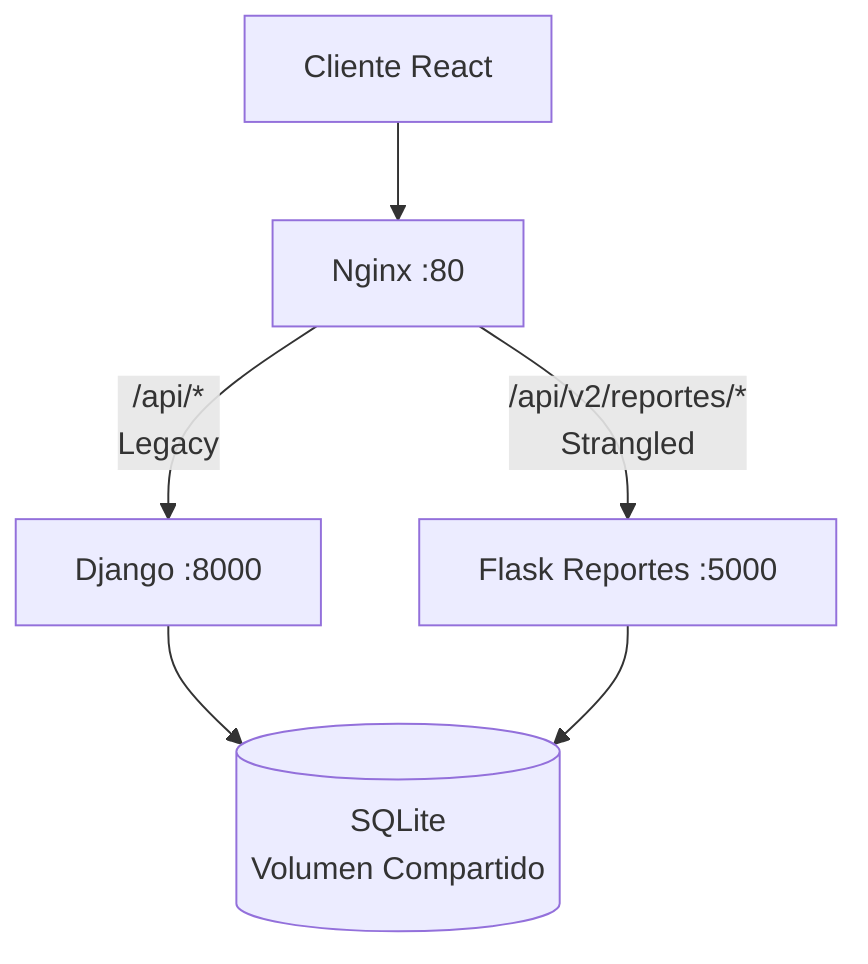
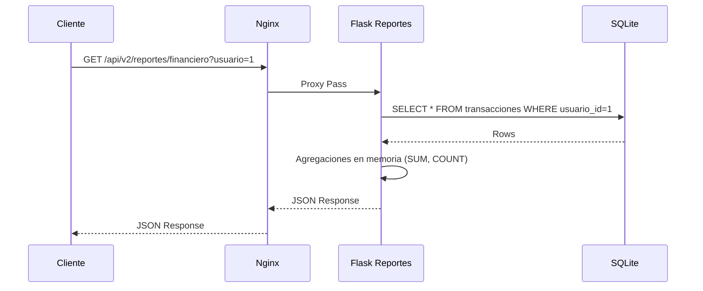

# Migración a Microservicios - Strangler Pattern

## Matriz de Decisión

| Módulo | Frecuencia Cambio | Consumo Recursos | Acoplamiento | Decisión |
|--------|-------------------|------------------|--------------|----------|
| Transacciones (CRUD) | Alta | Media | Muy Alto | Mantener en Django |
| Cuentas Bancarias | Media | Baja | Muy Alto | Mantener en Django |
| Suscripciones | Media | Media (batch) | Medio | Candidato futuro |
| Metas de Ahorro | Media | Media | Alto | Mantener en Django |
| **Reportes Financieros** | **Media** | **Muy Alta** | **Bajo-Medio** | **ESTRANGULAR (Flask)** |

## Justificación: Reportes Financieros

**Por qué estrangular este módulo:**

1. **Consumo de CPU Muy Alto**: Las consultas de agregación (`SUM`, `COUNT`, `GROUP BY`) sobre la tabla `transacciones_transaccion` bloquean el hilo principal de Django, causando timeouts en operaciones críticas de transacciones.

2. **Read-Mostly**: El módulo es mayormente de solo lectura (reportes, analytics), lo que facilita la separación sin problemas de consistencia transaccional.

3. **Escalabilidad Independiente**: Los reportes pueden beneficiarse de réplicas de lectura separadas y caché dedicado (Redis), sin afectar el monolito.

4. **Aislamiento de Fallos**: Un reporte lento o con error no debe impedir registrar ingresos/gastos ni transferencias.

5. **Evolución Independiente**: Los requisitos de reportes cambian frecuentemente (nuevas métricas, gráficos, exportación PDF/Excel) sin tocar la lógica transaccional.

## Solución Arquitectónica

### Nueva Topología de Red

```
                    ┌─────────────────┐
                    │     Cliente     │
                    │  (React Front)  │
                    └────────┬────────┘
                             │
                    ┌────────▼────────┐
                    │     Nginx       │
                    │  (Puerto 80)    │
                    └────────┬────────┘
                             │
              ┌──────────────┴──────────────┐
              │                             │
      ┌───────▼────────┐            ┌───────▼────────┐
      │    Django      │            │    Flask       │
      │  (Puerto 8000) │            │  (Puerto 5000) │
      └───────┬────────┘            └───────┬────────┘
              │                             │
              └──────────────┬──────────────┘
                             │
                    ┌────────▼────────┐
                    │   SQLite DB     │
                    │  (Volumen Compartido)    │
                    └─────────────────┘
```

### Routing Nginx (nginx.conf)

```nginx
# Monolito Legacy - Django
location / {
    proxy_pass http://django:8000;
}

# Microservicio Nuevo - Flask Reportes
location /api/v2/reportes/ {
    proxy_pass http://flask-reportes:5000;
}

# Compatibilidad v1 también a Flask
location /api/v1/reportes/ {
    proxy_pass http://flask-reportes:5000;
}
```

### Endpoints Migrados

| Funcionalidad | Django (Legacy) | Flask (Nuevo) |
|---------------|-----------------|---------------|
| Reporte Financiero | `GET /api/transacciones/reporte/?usuario=1&cuenta=1` | `GET /api/v2/reportes/financiero?usuario=1&cuenta=1` |
| Listar Transacciones | `GET /api/transacciones/?usuario=1` | `GET /api/v2/reportes/transacciones?usuario=1` |

### Docker Compose (docker-compose.yml)

```yaml
services:
  nginx:
    image: nginx:alpine
    ports:
      - "80:80"
    volumes:
      - ./nginx.conf:/etc/nginx/nginx.conf:ro
    depends_on:
      - django
      - flask-reportes

  django:
    build: .
    volumes:
      - ./:/app
      - db-data:/data
    environment:
      - DATABASE_PATH=/data/db.sqlite3
    expose:
      - "8000"

  flask-reportes:
    build: ./reportes_flask
    volumes:
      - db-data:/data
    environment:
      - DATABASE_PATH=/data/db.sqlite3
    expose:
      - "5000"

volumes:
  db-data:
```

## Impacto Esperado

### Beneficios Inmediatos
- **Latencia reducida** en endpoints transaccionales (POST /transacciones/) al no competir por CPU con reportes pesados
- **Escalado independiente**: Podemos agregar más réplicas de `flask-reportes` bajo carga sin escalar Django
- **Tecnología adecuada**: Flask + Gunicorn es más ligero para APIs de solo lectura que Django + DRF

### Métricas de Éxito
- Tiempo de respuesta P95 de `/api/transacciones/registrar/` < 200ms (antes podía ser > 2s bajo carga de reportes)
- Disponibilidad del monolito > 99.9% (reportes caídos no afectan transacciones)
- Deploy independiente: Cambios en reportes no requieren rebuild/deploy de Django

## Próximos Pasos (Roadmap)

1. **Fase 2**: Migrar **Suscripciones/Pagos Recurrentes** a microservicio worker (Celery/Flask) para procesamiento batch nocturno
2. **Fase 3**: Extraer **Autenticación/Autorización** a servicio dedicado (OAuth2/OIDC)
3. **Fase 4**: Migrar base de datos a PostgreSQL con réplicas de lectura para reportes

## Cómo Probar Localmente

```bash
# Levantar toda la stack
docker-compose up --build

# Probar endpoint legacy (Django)
curl http://localhost/api/transacciones/reporte/?usuario=1

# Probar endpoint nuevo (Flask via Nginx)
curl http://localhost/api/v2/reportes/financiero?usuario=1

# Health check Flask
curl http://localhost/api/v2/reportes/health
```

## Diagramas Mermaid

### Arquitectura Actual (Strangler Pattern Aplicado)



### Flujo de Request Reporte Financiero

