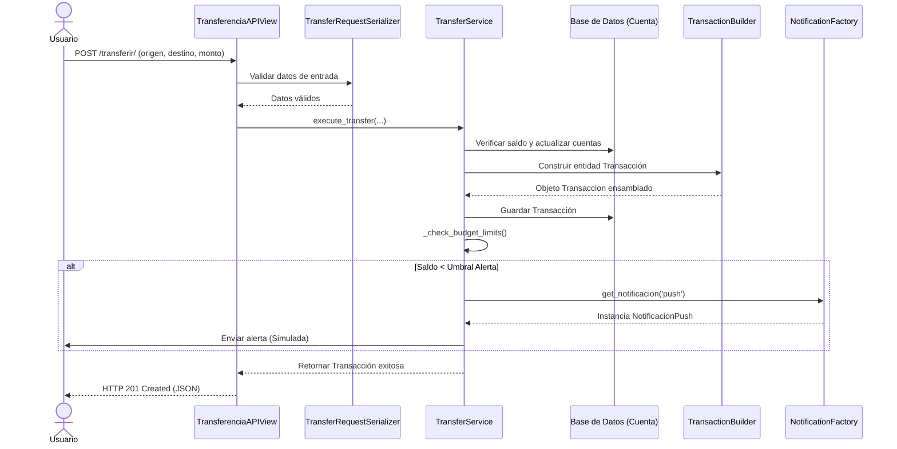

# Wiki Técnica - Arquitectura de Software

## 1. Justificación de la Estructura de Carpetas

Para esta entrega, adaptamos la arquitectura tradicional de Django hacia una estructura basada en capas con el fin de garantizar el Principio de Responsabilidad Única (SRP) y lograr un desacoplamiento total del sistema. Esta estructura sigue las mejores prácticas de arquitectura hexagonal [1][2].

### Componentes Principales:

* **`models.py`:** Contiene estrictamente las entidades de dominio (Cuenta, Categoria, Etiqueta, Presupuesto, Tope, Transaccion) y las validaciones de integridad de datos a nivel de base de datos y entidad (como evitar saldos negativos, categorías duplicadas o transferencias entre la misma cuenta). Las validaciones se implementan mediante el método `clean()` que es invocado automáticamente en `save()`.

* **`services.py`:** Centraliza toda la lógica de negocio y los flujos transaccionales orquestados por ServiceLayer [1]. Contiene las clases:
  * **TransferService:** Ejecuta transferencias entre cuentas con validación de fondos, transacciones atómicas y alertas presupuestarias.
  * **GastoService:** Registra gastos, actualiza presupuestos y verifica límites de gasto.
  * **PresupuestoService:** Gestiona presupuestos por categoría y proporciona análisis de estado.
  
  Esto elimina por completo los anti-patrones de *Fat Views* o *Fat Models* [3].

* **`serializers.py` y `views.py`:** Conforman la capa de presentación utilizando Django Rest Framework (DRF), dedicadas de forma exclusiva a la estructuración de datos de entrada/salida, validación de peticiones y control de códigos de estado HTTP (201, 400, 404, 409). Utilizan APIView para control total del flujo [4].

* **`patterns/`:** Aísla la lógica de los patrones creacionales requeridos:
  * **Builder (`builder.py`):** Implementa el patrón Builder para el ensamblaje paso a paso de la entidad compleja Transaccion. Permite configurar de forma flexible cuentas, categorías, etiquetas y detalles antes de persistir [5].
  * **Factory (`factory.py`):** Gestiona la creación dinámica de variantes de dependencias externas mediante el patrón Factory Method. Soporta múltiples tipos de notificaciones (Push, Email, SMS, Webhook) y es extensible [5][6].

---

## 2. Diagrama de Secuencia (Flujo de Transferencia y Topes)
El siguiente diagrama describe la interacción de los componentes durante la ejecución de una transferencia con validación de umbrales:

## 3. Visión de Escalabilidad y Preparación para un API Gateway

El sistema está arquitectónicamente preparado para integrarse de manera limpia detrás de un **API Gateway** por las siguientes razones:

* **Controladores Ligeros (`APIViews`):** Al no contener lógica de negocio, cálculos ni validaciones complejas, las vistas actúan únicamente como adaptadores de transporte HTTP [4]. Los APIView son delegados que reciben peticiones, las validan mediante serializers y orquestan la lógica a través del Service Layer.

* **Desacoplamiento de Servicios:** Toda la lógica reside en la capa de servicios (`services.py`), lo que permite que el backend pueda descomponerse o escalarse horizontalmente por dominios funcionales en el futuro. Esto facilita la transición a microservicios [2].

* **Integración con Gateway:** Un API Gateway centralizado (como Kong, Tyk o AWS API Gateway) [7][8] podrá encargarse de tareas transversales como:
  - Autenticación por tokens JWT
  - Limitación de peticiones (*rate limiting*)
  - Balanceo de carga y ruteo
  - Compresión y caché de respuestas
  - Transformación de solicitudes/respuestas
  
  Mientras que los endpoints de Django procesarán de forma estandarizada las solicitudes delegadas sin requerir modificaciones estructurales internas [4].

## 4. Estadísticas de Implementación

### Avance del Modelo de Datos

**Entidades Implementadas (6 total):**
- Cuenta: Gestión de cuentas con múltiples tipos (Banco, Efectivo, Tarjeta, Digital, Ahorros)
- Categoria: Clasificación de transacciones
- Etiqueta: Etiquetado flexible de transacciones
- Presupuesto: Control presupuestario por categoría
- Tope: Límites semanales y mensuales por cuenta
- Transaccion: Registro de transacciones con relaciones múltiples

**Líneas de código por componente:**
- models.py: 260 líneas
- services.py: 150 líneas
- views.py: 140 líneas
- serializers.py: 110 líneas
- patterns/builder.py: 75 líneas
- patterns/factory.py: 120 líneas

**Total: 855 líneas de código**

### Endpoints API Implementados

1. POST `/api/finanzas/transferir/` - Transferencias entre cuentas
2. POST `/api/finanzas/gastos/` - Registrar gastos
3. GET/POST `/api/finanzas/cuentas/` - Gestión de cuentas
4. GET/POST `/api/finanzas/categorias/` - Gestión de categorías
5. GET `/api/finanzas/cuentas/<id>/presupuestos/` - Estado de presupuestos

---

## Referencias Bibliográficas

[1] Martin Fowler, "Patterns of Enterprise Application Architecture", Addison-Wesley, 2002.
    - Referencia para Service Layer Pattern y arquitectura en capas.

[2] Sam Newman, "Building Microservices: Designing Fine-Grained Systems", O'Reilly Media, 2015.
    - Desacoplamiento de servicios y preparación para escalabilidad.

[3] Robert C. Martin, "Clean Code: A Handbook of Agile Software Craftsmanship", Prentice Hall, 2008.
    - Principios SOLID y evitar anti-patrones como Fat Models/Fat Controllers.

[4] Tom Christie, "Django REST Framework Documentation", https://www.django-rest-framework.org/, 2023.
    - Guía oficial de DRF, APIView, Serializers y mejores prácticas.

[5] Gang of Four (Gamma, Helm, Johnson, Vlissides), "Design Patterns: Elements of Reusable Object-Oriented Software", Addison-Wesley, 1994.
    - Patrones creacionales: Builder, Factory, Factory Method.

[6] Robert C. Martin, "Design Principles and Design Patterns", https://www.objectmentor.com/, 2000.
    - Principios de diseño orientado a objetos y patrones aplicables.

[7] Kong Inc., "Kong API Gateway Documentation", https://docs.konghq.com/, 2023.
    - Arquitectura y características de API Gateway Kong.

[8] AWS, "Amazon API Gateway Developer Guide", https://docs.aws.amazon.com/apigateway/, 2023.
    - Patrones de implementación en entornos cloud-native.

---

**Última actualización:** 26 de Agosto de 2026  
**Versión:** 2.0  
**Estado:** Entrega 1 - Completa
